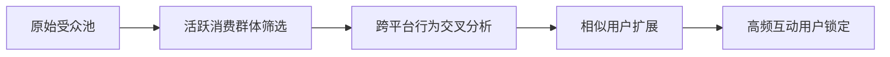

# Meta广告投放系统效能优化指南

---

## 精准受众管理策略
### 动态受众分层方法


### 受众运维标准
| 类型       | 更新周期 | 规模阈值  | 使用场景           |
|------------|----------|-----------|--------------------|
| 核心受众   | ≤5天     | 5K-50K    | 主推商品广告       |
| 扩展受众   | 7天      | 50K-200K  | 品牌曝光活动       |
| 定制受众   | 实时更新  | ≥2K       | 再营销活动         |

---

## 创意素材生命周期管理
### 素材迭代工作流
```process-map
新建素材 → A/B测试 → 效果追踪 → 优化迭代
    ↓            ↓           ↓          ↓
尺寸规范     版本对比     衰退预警     淘汰机制
```

### 视觉要素规范
| 广告类型   | 推荐尺寸       | 核心元素                    | 制作工具推荐        |
|------------|---------------|----------------------------|---------------------|
| 图片广告   | 1080x1080     | 产品特写+使用场景          | Canva/Chuangkit     |
| 视频广告   | 9:16-16:9     | 前3秒痛点呈现+用户见证     | CapCut/Animoto      |
| 轮播广告   | 600x600       | 主题连贯性+多角度展示      | Adobe Spark         |

---

## 预算智能调控方案
### 分时投放策略
```math
时段权重 = (时段CTR × 时段转化率) / (时段竞争指数 + 0.1)
```
| 时段区间     | 预算分配 | 运营重点               |
|--------------|----------|------------------------|
| 06:00-10:00  | 30%      | 通勤场景触达           |
| 12:00-14:00  | 20%      | 午餐时段即时促销       |
| 19:00-23:00  | 40%      | 深度互动内容投放       |

### 异常处理机制
| 异常指标       | 判断阈值     | 应急方案                          |
|----------------|--------------|-----------------------------------|
| CPM飙升        | 周均+30%     | 暂停组别→复制新组→时段拆分        |
| CTR下降        | 日均-20%     | 替换主图→调整文案→改变行动号召    |
| 转化成本异常   | 基准+25%     | 审查落地页→优化用户路径→排除低效版位 |

---

## 再营销深度运营
### 用户旅程规划
```user-flow
浏览商品页 → 加入购物车 → 放弃支付 → 收到定向优惠
   ↓              ↓             ↓             ↓
兴趣推荐      库存提醒      限时折扣      忠诚计划
```

### 分层触达策略
| 用户状态         | 时间窗口    | 内容类型           | 转化目标       |
|------------------|-------------|--------------------|----------------|
| 浏览未加购       | 24小时内    | 产品功能对比图     | 激发兴趣       |
| 加购未支付       | 3小时内     | 限时折扣码         | 促成交易       |
| 完成首次购买     | 7天后       | 关联商品推荐       | 提升客单价     |

---

## 系统化运维方案
### 日常维护流程
```daily-routine
1. 09:00 数据快照分析
2. 12:00 版位效果优化
3. 16:00 素材健康度检查
4. 21:00 预算动态调整
```

### 工具应用建议
| 功能需求         | 推荐工具                 | 核心优势                  |
|------------------|--------------------------|---------------------------|
| 视觉素材制作     | Canva专业版             | 百套电商模板库            |
| 视频剪辑优化     | InVideo AI               | 自动生成多语言字幕        |
| 数据深度分析     | Google Analytics 4       | 跨平台转化追踪            |
| 舆情监测         | Brand24                  | 实时社交口碑分析          |

---

> **优化执行建议**: 建立3个平行测试单元循环运行，每72小时刷新关键素材元素。优先采用自动化规则管理CPM异常波动，结合人工复核进行策略校准。建议周二/周四进行深度数据解读，周一/周五执行主要策略调整。
[教学视频](https://youtube.com/shorts/ukfVxCbbAuQ?feature=share)
